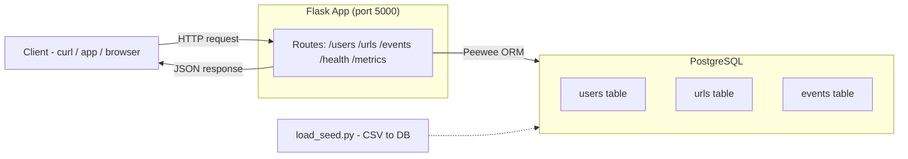

# URL Shortener — MLH PE Hackathon 2026

A production-style URL shortener backend built for the MLH Production Engineering Hackathon. No frontend — pure REST API with users, shortened URLs, and event analytics.

**Stack:** Flask · Peewee ORM · PostgreSQL · uv

---

## Architecture



---

## Prerequisites

- **uv** — Python package manager (handles versions, virtualenvs, dependencies)

  ```bash
  # macOS / Linux
  curl -LsSf https://astral.sh/uv/install.sh | sh

  # Windows (PowerShell)
  powershell -ExecutionPolicy ByPass -c "irm https://astral.sh/uv/install.ps1 | iex"
  ```

- **PostgreSQL** running locally (Docker or local install both work)

---

## Quick Start

```bash
# 1. Clone the repo
git clone https://github.com/sonephyo/PE-Hackathon-Template-2026.git
cd PE-Hackathon-Template-2026

# 2. Install dependencies
uv sync

# 3. Create the database
createdb hackathon_db

# 4. Configure environment
cp .env.example .env
# Edit .env if your DB credentials differ from the defaults

# 5. Load seed data
uv run load_seed.py

# 6. Run the server
uv run run.py

# 7. Verify it's running
curl http://localhost:5000/health
# → {"status":"ok"}
```

---

## Project Structure

```
.
├── app/
│   ├── __init__.py          # App factory (create_app)
│   ├── database.py          # DB connection, BaseModel, teardown hooks
│   ├── models/
│   │   └── __init__.py      # Register models here
│   └── routes/
│       └── __init__.py      # Register blueprints here
├── docs/                    # Full documentation
│   ├── api.md               # API endpoint reference
│   ├── architecture.md      # Architecture diagram and overview
│   ├── deploy.md            # Deploy and rollback guide
│   ├── troubleshooting.md   # Common issues and fixes
│   ├── config.md            # Environment variable reference
│   ├── runbooks.md          # Incident response runbooks
│   ├── decision-log.md      # Technical decision log
│   └── capacity-plan.md     # Capacity and scaling plan
├── users.csv                # Seed data — users
├── urls.csv                 # Seed data — shortened URLs
├── events.csv               # Seed data — analytics events
├── load_seed.py             # Script to load CSV seed data into DB
├── .env.example             # Environment variable template
├── .gitignore
├── .python-version          # Python version pin for uv
├── pyproject.toml           # Project metadata and dependencies
├── run.py                   # Entry point — use `uv run run.py`
└── README.md
```

---

## Environment Variables

Copy `.env.example` to `.env` and update as needed:

| Variable | Default | Description |
|---|---|---|
| `DATABASE_NAME` | `hackathon_db` | PostgreSQL database name |
| `DATABASE_HOST` | `localhost` | PostgreSQL host |
| `DATABASE_PORT` | `5432` | PostgreSQL port |
| `DATABASE_USER` | `postgres` | PostgreSQL username |
| `DATABASE_PASSWORD` | `postgres` | PostgreSQL password |

---

## Seed Data

The repo includes three CSV files used to pre-populate the database:

| File | Description |
|---|---|
| `users.csv` | Sample user accounts |
| `urls.csv` | Sample shortened URLs |
| `events.csv` | Sample analytics events |

Load them all at once:

```bash
uv run load_seed.py
```

---

## API Endpoints

Full API documentation is in [`docs/api.md`](docs/api.md). Quick reference:

| Method | Path | Description |
|---|---|---|
| `GET` | `/health` | Health check |
| `GET` | `/users` | List all users |
| `GET` | `/users/<id>` | Get user by ID |
| `POST` | `/users` | Create a user |
| `POST` | `/users/bulk` | Bulk import users from CSV |
| `PUT` | `/users/<id>` | Update a user |
| `DELETE` | `/users/<id>` | Delete a user |
| `GET` | `/urls` | List all URLs |
| `GET` | `/urls/<id>` | Get URL by ID |
| `GET` | `/urls/active` | List active URLs only |
| `POST` | `/urls` | Create a shortened URL |
| `PUT` | `/urls/<id>` | Update a URL |
| `DELETE` | `/urls/<id>` | Delete a URL |
| `GET` | `/<short_code>` | Redirect to original URL |
| `GET` | `/events` | List all analytics events |
| `POST` | `/events` | Create an event |
| `GET` | `/metrics` | CPU/RAM usage metrics |

---

## Documentation

All docs are in the [`docs/`](docs/) folder and cover Bronze through Gold tier:

- [API Reference](docs/api.md)
- [Architecture](docs/architecture.md)
- [Deploy Guide](docs/deploy.md)
- [Troubleshooting](docs/troubleshooting.md)
- [Configuration](docs/config.md)
- [Runbooks](docs/runbooks.md)
- [Decision Log](docs/decision-log.md)
- [Capacity Plan](docs/capacity-plan.md)

### Error Handling

Detailed error handling documentation is in [`error-handling/`](error-handling/):

- [Status Codes](error-handling/status-codes.md)
- [Failure Modes](error-handling/failure-modes.md)
- [Validation Rules](error-handling/validation-rules.md)

---

## Team

| Name | Track |
|---|---|
| Aaron | Reliability |
| Sone | Observability |
| JJ | Scalability |
| Sriky | Scalability |
| Cameron | Documentation |

---

## Hackathon

- **Event:** MLH Production Engineering Hackathon 2026
- **Dates:** April 3–5, 2026
- **Docs track:** Bronze → Silver → Gold
- **Repo:** [sonephyo/PE-Hackathon-Template-2026](https://github.com/sonephyo/PE-Hackathon-Template-2026)
