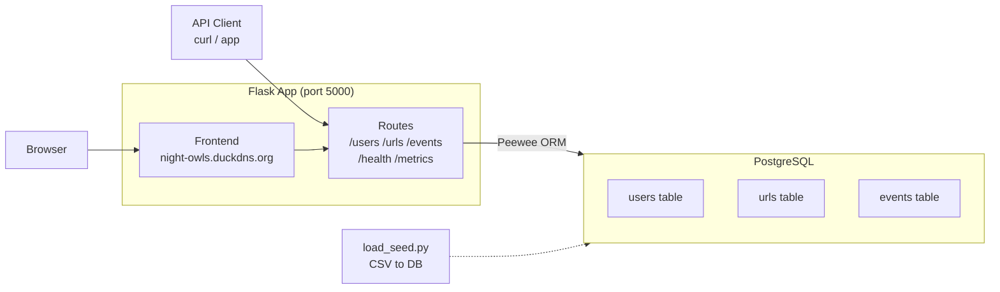

# URL Shortener — MLH PE Hackathon 2026

A production-grade URL shortener with a web frontend and REST API backend. Built for the MLH Production Engineering Hackathon.

**Live:** [night-owls.duckdns.org](https://night-owls.duckdns.org)

**Stack:** Flask · Peewee ORM · PostgreSQL · uv · Nginx · Docker Compose

---

## Architecture



---

## Prerequisites

- **uv** — Python package manager (handles versions, virtualenvs, dependencies)

  ```bash
  # macOS / Linux
  curl -LsSf https://astral.sh/uv/install.sh | sh

  # Windows (PowerShell)
  powershell -ExecutionPolicy ByPass -c "irm https://astral.sh/uv/install.ps1 | iex"
  ```

- **PostgreSQL** running locally (Docker or local install both work)

---

## Quick Start

```bash
# 1. Clone the repo
git clone https://github.com/sonephyo/NightOwls-PE-Hackathon-2026.git
cd NightOwls-PE-Hackathon-2026

# 2. Install dependencies
uv sync

# 3. Create the database
createdb hackathon_db

# 4. Configure environment
cp .env.example .env

# 5. Load seed data
uv run load_seed.py

# 6. Run the server
uv run run.py

# 7. Verify
curl http://localhost:5000/health
# → {"status":"ok"}
```

---

## Project Structure

```
.
├── app/
│   ├── __init__.py          # App factory, error handlers
│   ├── database.py          # DB connection, BaseModel
│   ├── models/              # User, URL, Event models
│   ├── routes/              # API blueprints
│   └── templates/           # Frontend HTML
├── docs/                    # Full documentation
│   ├── api.md               # API endpoint reference
│   ├── architecture.md      # Architecture overview
│   ├── deploy.md            # Deploy and rollback guide
│   ├── troubleshooting.md   # Common issues and fixes
│   ├── config.md            # Environment variable reference
│   ├── runbooks.md          # Incident response runbooks
│   ├── decision-log.md      # Technical decision log
│   ├── capacity-plan.md     # Capacity and scaling plan
│   └── screenshots/         # Evidence screenshots
├── error-handling/          # Error handling documentation
│   ├── README.md            # Overview and quick reference
│   ├── status-codes.md      # HTTP status codes
│   ├── failure-modes.md     # Failure scenarios and recovery
│   └── validation-rules.md  # Input validation rules
├── reports/                 # Performance and incident reports
│   ├── bottleneck-analysis.md
│   ├── incident-response-bronze.md
│   ├── incident-response-silver.md
│   └── incident-response-gold.md
├── monitoring/              # Prometheus, Grafana, Alertmanager
├── nginx/                   # Nginx load balancer config
├── tests/                   # Unit and integration tests
├── users.csv                # Seed data
├── urls.csv                 # Seed data
├── events.csv               # Seed data
├── load_seed.py             # Load CSV seed data into DB
├── docker-compose.yml       # Multi-container deployment
├── Dockerfile               # Container definition
├── autoscaler.py            # Auto-scaling logic
├── load_test.js             # k6 load test scripts
├── .env.example             # Environment variable template
├── pyproject.toml           # Project metadata
└── run.py                   # Entry point
```

---

## Environment Variables

| Variable | Default | Description |
|---|---|---|
| `DATABASE_NAME` | `hackathon_db` | PostgreSQL database name |
| `DATABASE_HOST` | `localhost` | PostgreSQL host |
| `DATABASE_PORT` | `5432` | PostgreSQL port |
| `DATABASE_USER` | `postgres` | PostgreSQL username |
| `DATABASE_PASSWORD` | `postgres` | PostgreSQL password |
| `FLASK_DEBUG` | `0` | Set to `1` for debug mode |

---

## API Endpoints

Full docs in [`docs/api.md`](docs/api.md). Quick reference:

| Method | Path | Description |
|---|---|---|
| `GET` | `/health` | Health check |
| `GET` | `/users` | List all users |
| `GET` | `/users/<id>` | Get user by ID |
| `POST` | `/users` | Create a user |
| `POST` | `/users/bulk` | Bulk import users from CSV |
| `PUT` | `/users/<id>` | Update a user |
| `DELETE` | `/users/<id>` | Delete a user |
| `GET` | `/urls` | List all URLs |
| `GET` | `/urls/<id>` | Get URL by ID |
| `GET` | `/urls/active` | List active URLs only |
| `POST` | `/urls` | Create a shortened URL |
| `PUT` | `/urls/<id>` | Update a URL |
| `DELETE` | `/urls/<id>` | Delete a URL |
| `GET` | `/<short_code>` | Redirect to original URL |
| `GET` | `/events` | List all analytics events |
| `POST` | `/events` | Create an event |
| `GET` | `/metrics` | CPU/RAM metrics |

---

## Error Handling

All errors return JSON. See [`error-handling/`](error-handling/) for full docs.

| Status | Meaning |
|---|---|
| `200` | Success |
| `201` | Created |
| `302` | Redirect |
| `400` | Bad input |
| `404` | Not found / inactive URL |
| `500` | Server error |

---

## Documentation

- [API Reference](docs/api.md)
- [Architecture](docs/architecture.md)
- [Deploy Guide](docs/deploy.md)
- [Troubleshooting](docs/troubleshooting.md)
- [Configuration](docs/config.md)
- [Runbooks](docs/runbooks.md)
- [Decision Log](docs/decision-log.md)
- [Capacity Plan](docs/capacity-plan.md)

---

## Team

| Name | Track |
|---|---|
| Aaron | Reliability |
| Sone | Observability |
| JJ | Scalability |
| Sriky | Scalability |
| Cameron | Documentation |

---

## Hackathon

- **Event:** MLH Production Engineering Hackathon 2026
- **Dates:** April 3–5, 2026
- **Repo:** [sonephyo/NightOwls-PE-Hackathon-2026](https://github.com/sonephyo/NightOwls-PE-Hackathon-2026)
