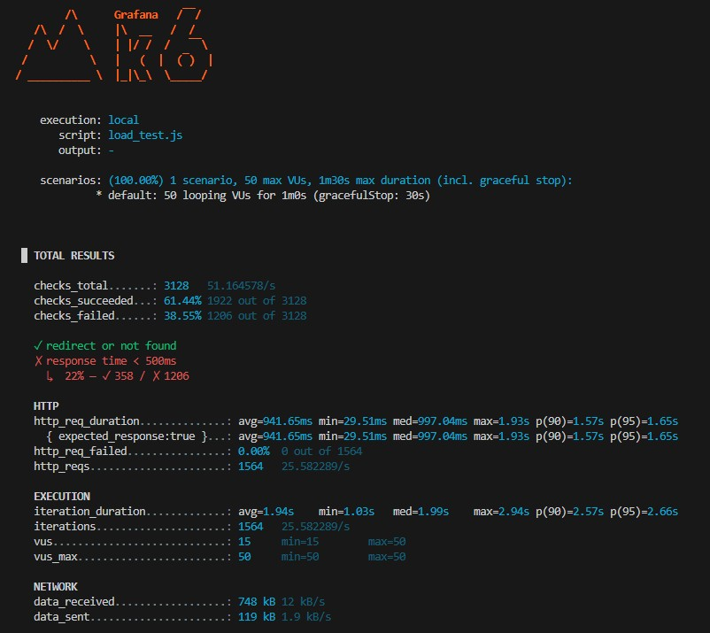
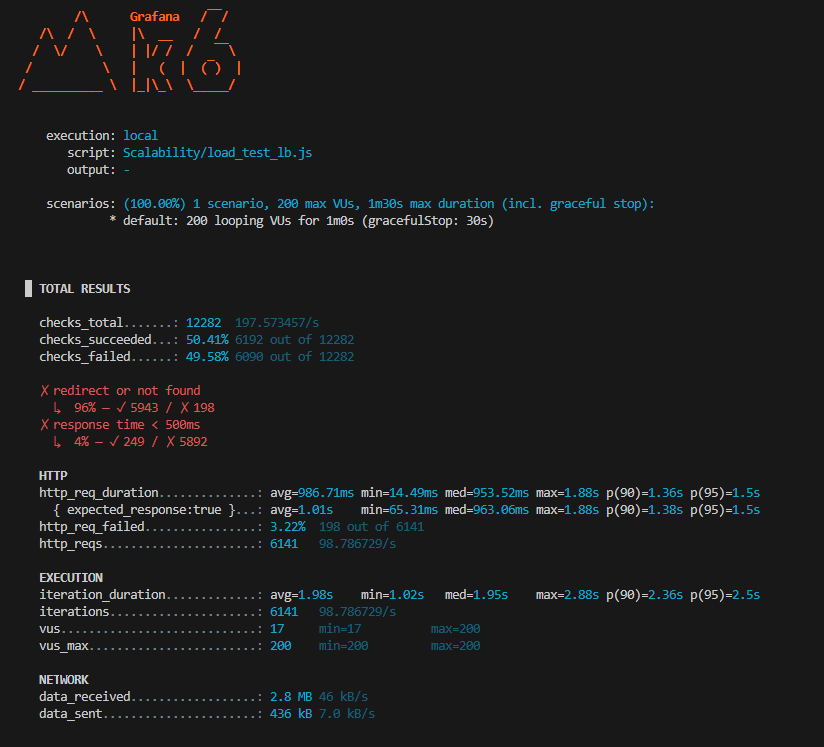

# Bronze 

## Summary

I ran the test with 50 concurrent users for the URL shortener application and the results were:
- the **p95 response time** was 1.65s. 
- The **error rate** was 0%. 

# Silver 

## Initial Test Summary

I ran 200 concurrent users against the URL shortener application. Base on the K6 test results could not run 200 concurrent users under 3 seconds. 

## Next Steps
I setup the 2 docker instances of the URL shortener application and created a load balancer with Ngix to direct traffic between the two instances  using the least_conn parameter. Base on the K6 test results could run 200 concurrent users under 3 seconds.

## After Optimizations

**Optimizations Applied:**
1. **Production WSGI Server (Gunicorn)** - Replaced Flask dev server with Gunicorn, 4 workers per container
2. **Fixed Database Connection Bug** - Removed invalid `max_connections` and `stale_timeout` parameters
3. **Optimized Nginx Load Balancer** - Changed to `least_conn` algorithm, added HTTP keepalive, increased worker connections to 2048

**Results:**
- Average response time: **3.16s → 986ms** (69% improvement)
- p95 response time: **4.11s → 1.5s** (63% improvement)
- Max response time: **5.42s → 1.88s** (65% improvement)
- HTTP failure rate: **5.34% → 3.22%**

All responses now under **3 seconds** 
