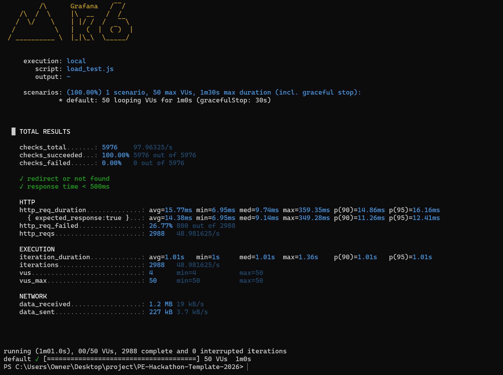
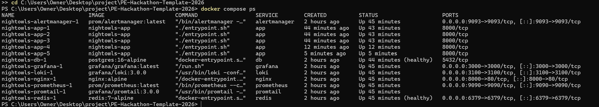
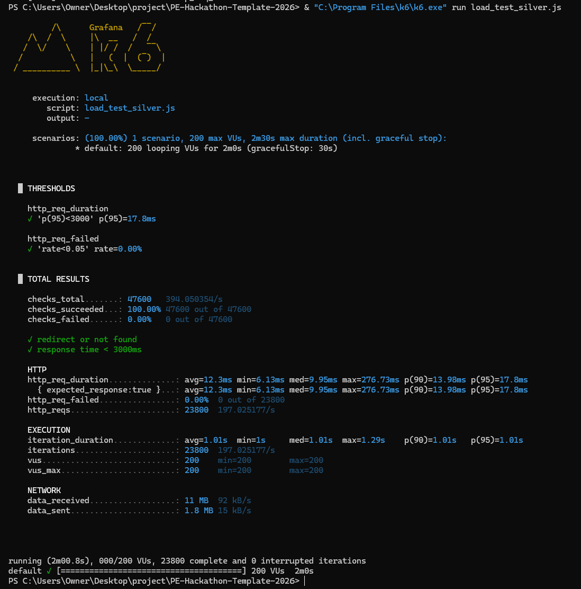
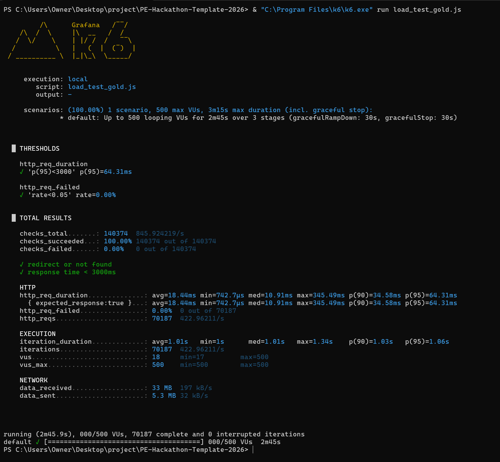
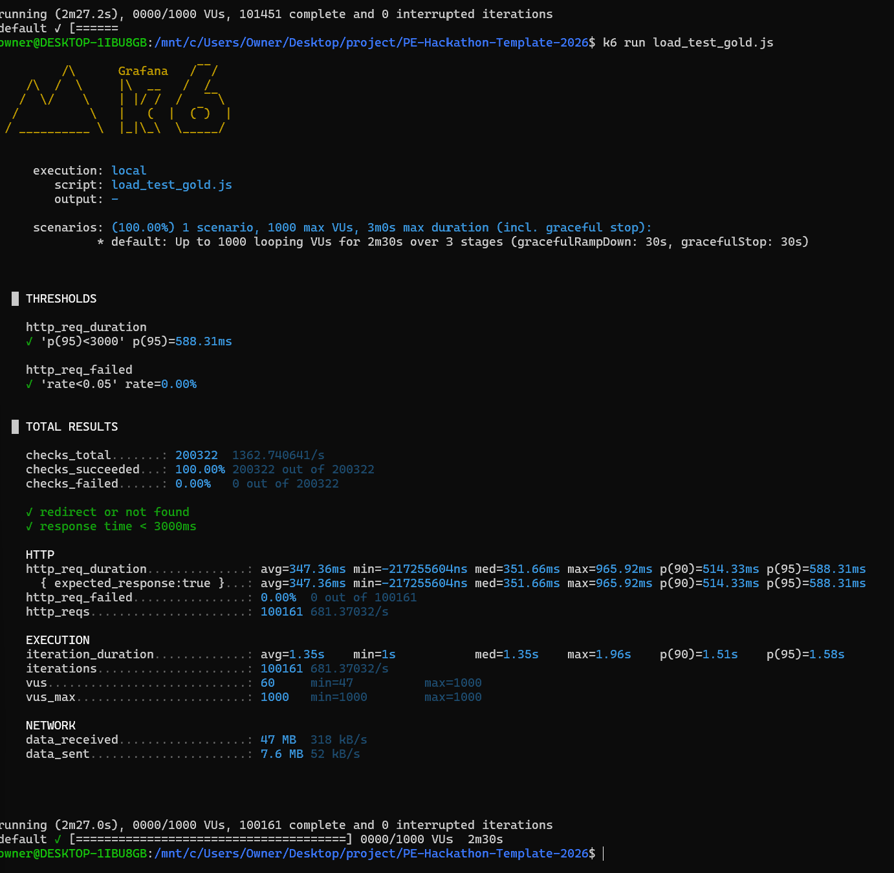
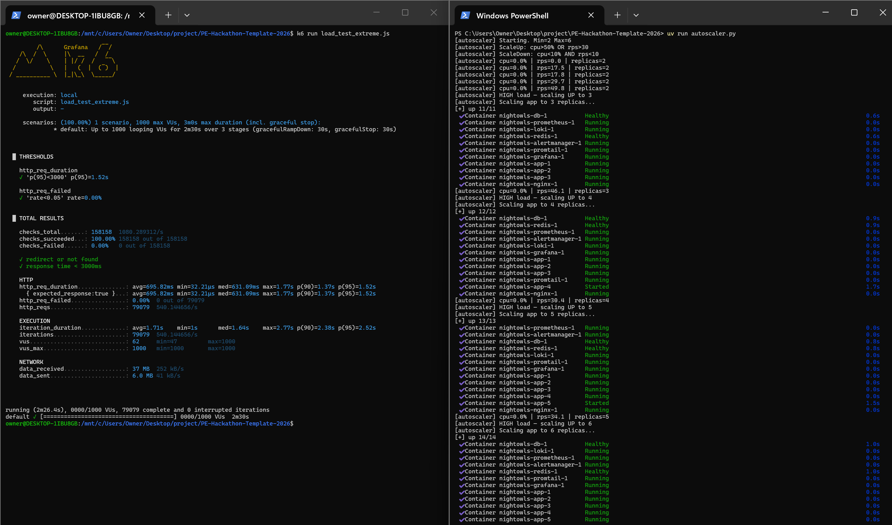

# User Manual — URL Shortener (PE Hackathon 2026)

> Covers: Architecture, API Reference, Environment Variables, Deployment, Troubleshooting, Runbooks, Decision Log, Capacity Plan.

---

## Table of Contents

1. [Architecture](#architecture)
2. [API Reference](#api-reference)
3. [Environment Variables](#environment-variables)
4. [Deployment Guide](#deployment-guide)
5. [Rollback Guide](#rollback-guide)
6. [Troubleshooting](#troubleshooting)
7. [Runbooks](#runbooks)
8. [Decision Log](#decision-log)
9. [Capacity Plan](#capacity-plan)

---

## Architecture

### System Diagram

```
                        ┌─────────────────────────────────────────────────┐
                        │               Docker Network: observability       │
                        │                                                   │
  Browser / Client      │   ┌─────────────────────┐                        │
  ─────────────────────►│   │   Flask App          │                        │
  http://localhost:8000 │   │   (Gunicorn :8000)   │◄──── scrape /metrics ──┤
                        │   │                      │                        │
                        │   │  - URL shortening    │      ┌──────────────┐  │
                        │   │  - Redirect logic    │      │  Prometheus  │  │
                        │   │  - REST API          │      │   (:9090)    │  │
                        │   │  - Structured logs   │      └──────┬───────┘  │
                        │   └──────────┬───────────┘             │          │
                        │              │ SQL                      │ query    │
                        │   ┌──────────▼───────────┐      ┌──────▼───────┐  │
                        │   │   PostgreSQL          │      │   Grafana    │  │
                        │   │      (:5432)          │      │   (:3000)    │  │
                        │   │                       │      └──────┬───────┘  │
                        │   │  - users table        │             │ query    │
                        │   │  - urls table         │      ┌──────▼───────┐  │
                        │   │  - events table       │      │     Loki     │  │
                        │   └───────────────────────┘      │   (:3100)    │  │
                        │                                  └──────▲───────┘  │
                        │   ┌───────────────────────┐             │          │
                        │   │       Promtail         │─────────────┘          │
                        │   │   (log forwarder)      │  push logs             │
                        │   └───────────────────────┘                        │
                        │                                                     │
                        │   ┌───────────────────────┐                        │
                        │   │    Alertmanager        │                        │
                        │   │      (:9093)           │                        │
                        │   └───────────────────────┘                        │
                        └─────────────────────────────────────────────────────┘
```

### Data Flow — Shorten a URL

```
1. User submits URL via browser or POST /urls
2. App checks if original_url already exists in DB
   ├── Yes → return existing short code (HTTP 200)
   └── No  → generate 6-char random code → save to DB → return (HTTP 201)
3. User visits http://localhost:8000/<short_code>
4. App looks up short_code in DB
   ├── Found + active   → HTTP 302 redirect to original_url
   ├── Found + inactive → HTTP 410 Gone
   └── Not found        → HTTP 404
```

### Services Summary

| Service | Image | Port | Purpose |
|---|---|---|---|
| app | custom (Python 3.13) | 8000 | Flask URL shortener |
| db | postgres:16-alpine | 5432 (internal) | Data persistence |
| prometheus | prom/prometheus:latest | 9090 | Metrics collection |
| loki | grafana/loki:3.0.0 | 3100 (internal) | Log aggregation |
| promtail | grafana/promtail:3.0.0 | — | Forwards Docker logs to Loki |
| grafana | grafana/grafana:latest | 3000 | Dashboards & log viewer |
| alertmanager | prom/alertmanager:latest | 9093 | Alert routing |

---

## API Reference

### Base URL
```
http://localhost:8000
```

---

### Health & Metrics

#### `GET /health`
Returns service health status. Used by load balancers to check if the app is alive.

**Response `200`**
```json
{ "status": "ok" }
```

---

#### `GET /metrics`
Returns Prometheus-formatted metrics. Scraped automatically every 5 seconds.

**Metrics exposed:**

| Metric | Type | Description |
|---|---|---|
| `app_cpu_usage_percent` | Gauge | Flask process CPU % |
| `app_ram_usage_mb` | Gauge | Flask process memory (MB) |
| `app_urls_created_total` | Counter | Total URLs shortened |
| `app_redirects_total` | Counter | Total redirects served |

**Response `200`** — plain text Prometheus format
```
# HELP app_cpu_usage_percent Flask process CPU usage percent
# TYPE app_cpu_usage_percent gauge
app_cpu_usage_percent 0.5
```

---

### URL Shortening

#### `GET /`
Serves the browser-based frontend UI.

---

#### `GET /urls`
Returns a paginated list of all shortened URLs.

**Query Parameters**

| Param | Type | Default | Description |
|---|---|---|---|
| `page` | int | 1 | Page number |
| `per_page` | int | 50 | Results per page |
| `user_id` | int | — | Filter by user |

**Response `200`**
```json
[
  {
    "id": 1,
    "short_code": "0Y7puX",
    "original_url": "https://example.com",
    "title": "Example Site",
    "is_active": true,
    "created_at": "Sat, 27 Sep 2025 19:12:17 GMT",
    "updated_at": "Sat, 04 Oct 2025 11:18:27 GMT",
    "user_id": { "id": 1, "username": "livelypioneer98", "email": "..." }
  }
]
```

---

#### `GET /urls/<id>`
Returns a single URL record by database ID.

**Response `200`** — same shape as above
**Response `404`**
```json
{ "error": "URL not found" }
```

---

#### `GET /urls/code/<short_code>`
Returns a single URL record by short code (does not redirect).

**Example**
```bash
curl http://localhost:8000/urls/code/0Y7puX
```

**Response `200`** — same shape as `GET /urls/<id>`
**Response `404`**
```json
{ "error": "URL not found" }
```

---

#### `POST /urls`
Creates a new shortened URL. If the `original_url` already exists in the database, returns the existing record instead of creating a duplicate.

**Request Body**

| Field | Type | Required | Description |
|---|---|---|---|
| `original_url` | string | Yes | The full URL to shorten |
| `short_code` | string | No | Custom short code (auto-generated if omitted) |
| `title` | string | No | Human-readable label |
| `user_id` | int | No | Owner user ID (defaults to 1) |
| `is_active` | bool | No | Whether redirects are enabled (default: true) |

**Example**
```bash
curl -X POST http://localhost:8000/urls \
  -H "Content-Type: application/json" \
  -d '{"original_url": "https://github.com", "title": "GitHub"}'
```

**Response `201`** — new URL created
**Response `200`** — URL already existed, existing record returned
**Response `400`**
```json
{ "error": "original_url required" }
```

---

#### `PUT /urls/<id>`
Updates an existing URL record.

**Request Body** (all fields optional)

| Field | Type | Description |
|---|---|---|
| `original_url` | string | New destination URL |
| `title` | string | New title |
| `is_active` | bool | Enable or disable redirects |

**Example — disable a URL**
```bash
curl -X PUT http://localhost:8000/urls/2003 \
  -H "Content-Type: application/json" \
  -d '{"is_active": false}'
```

**Response `200`** — updated record
**Response `404`** — URL not found

---

#### `DELETE /urls/<id>`
Permanently deletes a URL record.

**Response `200`**
```json
{ "message": "Deleted" }
```
**Response `404`** — URL not found

---

#### `GET /<short_code>`
Redirects to the original URL. This is the core shortener feature.

**Response `302`** — redirect to `original_url`
**Response `404`** — short code not found
**Response `410`** — short code exists but `is_active` is false

---

#### `POST /urls/bulk`
Imports URLs in bulk from a CSV file upload.

**CSV columns:** `id, user_id, short_code, original_url, title, is_active, created_at, updated_at`

**Example**
```bash
curl -X POST http://localhost:8000/urls/bulk \
  -F "file=@data/urls.csv"
```

**Response `201`**
```json
{ "count": 10000 }
```

---

### Users

#### `GET /users`
Returns paginated list of users. Supports `page` and `per_page` query params.

#### `GET /users/<id>`
Returns a single user by ID.
**Response `404`** if not found.

#### `POST /users`
Creates a new user.

**Request Body**

| Field | Type | Required |
|---|---|---|
| `username` | string | Yes |
| `email` | string | Yes (must be unique) |

**Response `201`** — created user
**Response `400`** — missing or invalid fields

#### `PUT /users/<id>`
Updates `username` and/or `email` for a user.

#### `DELETE /users/<id>`
Deletes a user.

#### `POST /users/bulk`
Bulk import from CSV. **CSV columns:** `id, username, email, created_at`

---

### Events

Events track activity such as URL clicks.

#### `GET /events`
Returns paginated list of events. Supports `page` and `per_page`.

#### `GET /events/<id>`
Returns a single event by ID.

#### `POST /events`
Creates a new event.

**Request Body**

| Field | Type | Required | Description |
|---|---|---|---|
| `url_id` | int | Yes | The URL this event belongs to |
| `user_id` | int | Yes | The user who triggered it |
| `event_type` | string | Yes | e.g. `"click"`, `"view"` |
| `details` | object | No | Any extra JSON metadata |

#### `POST /events/bulk`
Bulk import from CSV. **CSV columns:** `id, url_id, user_id, event_type, timestamp, details`

---

## Environment Variables

All variables are read from a `.env` file at project root. Copy `.env.example` to get started:

```bash
cp .env.example .env
```

| Variable | Default | Required | Description |
|---|---|---|---|
| `FLASK_DEBUG` | `false` | No | Enables Flask debug mode. **Never set to `true` in production.** |
| `DATABASE_NAME` | `hackathon_db` | Yes | PostgreSQL database name |
| `DATABASE_HOST` | `localhost` | Yes | DB host. Use `db` when running inside Docker Compose. |
| `DATABASE_PORT` | `5432` | Yes | PostgreSQL port |
| `DATABASE_USER` | `postgres` | Yes | PostgreSQL username |
| `DATABASE_PASSWORD` | `postgres` | Yes | PostgreSQL password |

> **Note:** When running via `docker compose`, the environment variables are set directly in `docker-compose.yml` and override `.env`. The `.env` file is only used when running the app locally outside Docker (e.g. `uv run run.py`).

---

## Deployment Guide

### First-Time Setup

```bash
# 1. Clone the repository
git clone <repo-url>
cd PE-Hackathon-Template-2026

# 2. (Optional) Install Python dependencies for local development
uv sync

# 3. Start all services
docker compose up --build
```

The first run will:
- Build the Flask app Docker image
- Pull Prometheus, Grafana, Loki, and other images
- Start PostgreSQL and wait for it to be healthy
- Run `seed.py` to create tables and load sample data (~1000 users, ~10k URLs, ~20k events)
- Start Gunicorn with 2 workers on port 8000

**Verify everything is running:**
```bash
curl http://localhost:8000/health
# → {"status": "ok"}
```

### Updating the App After Code Changes

```bash
# Rebuild and restart only the app container (leaves DB and monitoring running)
docker compose up --build -d app
```

### Stopping the Stack

```bash
# Stop containers but keep data volumes
docker compose down

# Stop and delete all data (full reset)
docker compose down -v
```

### Accessing the Services

| Service | URL | Credentials |
|---|---|---|
| App (frontend) | http://localhost:8000 | — |
| Grafana | http://localhost:3000 | admin / admin |
| Prometheus | http://localhost:9090 | — |
| Alertmanager | http://localhost:9093 | — |

---

## Rollback Guide

### Rolling Back a Bad Code Change

```bash
# 1. Revert the code change
git revert HEAD        # creates a new revert commit
# or
git checkout HEAD~1 -- app/   # restore previous app folder

# 2. Rebuild and redeploy the app
docker compose up --build -d app

# 3. Verify health
curl http://localhost:8000/health
```

### Rolling Back a Database Migration

The app uses `db.create_tables(safe=True)` — it only creates tables, never drops or alters them. There are no destructive migrations. If a column was added manually:

```bash
# Connect to the database
docker exec -it nightowls-db-1 psql -U postgres -d hackathon_db

# Inspect the table
\d urls

# Drop a column if needed
ALTER TABLE urls DROP COLUMN IF EXISTS <column_name>;
```

### Full Reset (Nuclear Option)

```bash
docker compose down -v       # removes all containers + volumes (deletes all data)
docker compose up --build    # fresh start, seeds from CSV again
```

---

## Troubleshooting

### App returns 500 on `POST /urls`

**Symptom:** `{"error": "internal server error"}` when creating a URL.

**Cause 1 — PostgreSQL sequence out of sync after seed**
After CSV bulk import, PostgreSQL's auto-increment counter isn't updated. The next `INSERT` tries ID 1 which already exists.

**Fix:**
```bash
docker exec nightowls-db-1 psql -U postgres -d hackathon_db -c "
  SELECT setval('urls_id_seq', (SELECT MAX(id) FROM urls));
  SELECT setval('users_id_seq', (SELECT MAX(id) FROM users));
  SELECT setval('events_id_seq', (SELECT MAX(id) FROM events));
"
```

**Cause 2 — `user_id` is null**
If no `user_id` is sent and the DB column is NOT NULL, the insert fails.

**Fix:** The `create_url` route now defaults `user_id` to 1 if not provided. If you see this again, check that the correct version of the code is running: `docker compose up --build -d app`.

---

### Docker build fails with `/bin/sh^M: not found`

**Symptom:** Docker build fails immediately when trying to run `entrypoint.sh`.

**Cause:** The shell script has Windows CRLF (`\r\n`) line endings. Linux inside Docker can't parse them.

**Fix:**
```bash
sed -i 's/\r//' entrypoint.sh
sed -i 's/\r//' Dockerfile
```

A `.gitattributes` file is in place to prevent this recurring on future commits.

---

### `curl http://localhost:8000/urls/2Ngd3j` returns `{"error": "not found"}`

**Cause:** `GET /urls/<id>` only accepts a numeric database ID, not a short code.

**Fix:** Use the correct endpoint:
```bash
curl http://localhost:8000/urls/code/2Ngd3j   # look up by short code
curl http://localhost:8000/2Ngd3j              # redirect by short code
```

---

### Port already in use

**Symptom:** `Bind for 0.0.0.0:8000 failed: port is already allocated`

**Fix:**
```bash
docker compose down
docker compose up --build
```

If the port is taken by another process:
```bash
# Find and kill the process using port 8000
lsof -i :8000          # macOS/Linux
netstat -ano | findstr :8000   # Windows
```

---

### Container keeps restarting

```bash
# Check what's failing
docker logs nightowls-app-1 --tail 50

# Common causes:
# - DB not ready yet (wait 10s and check again)
# - Missing environment variable
# - Syntax error in Python code
```

---

### Grafana shows no data

1. Open http://localhost:9090/targets — check the `flask-app` target is **UP**
2. If DOWN: the app `/metrics` endpoint isn't reachable from Prometheus. Make sure the app is healthy first.
3. In Grafana → Explore → select Prometheus → run `app_cpu_usage_percent` — if it returns data, the pipeline works.

---

## Runbooks

Runbooks are step-by-step guides for when an alert fires.

---

### Runbook: App Is Down

**Alert condition:** `GET /health` returns non-200 or times out.

**Steps:**
1. Check if the container is running:
   ```bash
   docker compose ps
   ```
2. If the `app` container shows `Exited` or `Restarting`, check logs:
   ```bash
   docker logs nightowls-app-1 --tail 100
   ```
3. Check if the database is healthy (app won't start without it):
   ```bash
   docker compose ps db
   ```
4. If DB is unhealthy, restart it:
   ```bash
   docker compose restart db
   ```
5. Restart the app:
   ```bash
   docker compose restart app
   ```
6. Verify recovery:
   ```bash
   curl http://localhost:8000/health
   ```

---

### Runbook: High Error Rate

**Alert condition:** Many `500` responses in logs or metrics.

**Steps:**
1. Check recent error logs:
   ```bash
   docker logs nightowls-app-1 --tail 50 2>&1 | grep ERROR
   ```
2. In Grafana → Explore → Loki → query:
   ```
   {service="app"} | json | level="error"
   ```
3. Look for patterns — is it always the same endpoint? Same input?
4. If it's a DB connection error, check the DB container and sequences (see Troubleshooting above).
5. If it's a code bug, revert with `git revert HEAD` and rebuild.

---

### Runbook: High Memory Usage

**Alert condition:** `app_ram_usage_mb` gauge exceeds threshold.

**Steps:**
1. Check current RAM:
   ```bash
   curl -s http://localhost:8000/metrics | grep app_ram_usage_mb
   ```
2. Check how many Gunicorn workers are running:
   ```bash
   docker exec nightowls-app-1 ps aux | grep gunicorn
   ```
3. If memory is growing over time (leak), restart the app to recover:
   ```bash
   docker compose restart app
   ```
4. Investigate the request that caused the spike in Grafana.

---

### Runbook: Database Unreachable

**Alert condition:** App logs `OperationalError: could not connect to server`.

**Steps:**
1. Check DB container:
   ```bash
   docker compose ps db
   ```
2. Check DB logs:
   ```bash
   docker logs nightowls-db-1 --tail 50
   ```
3. Check disk space (Postgres stops if disk is full):
   ```bash
   docker exec nightowls-db-1 df -h
   ```
4. Restart DB:
   ```bash
   docker compose restart db
   ```
5. Wait ~10 seconds for healthcheck to pass, then restart app:
   ```bash
   docker compose restart app
   ```

---

## Decision Log

### Why Flask?
Flask is a lightweight Python web framework with minimal boilerplate. For a URL shortener with simple CRUD routes and redirects, a full framework like Django would be over-engineering. Flask gives full control over routing and is well-documented for REST APIs.

### Why PostgreSQL?
PostgreSQL is ACID-compliant and handles concurrent writes correctly. URL shorteners need unique short codes — PostgreSQL's `UNIQUE` constraint enforces this at the database level, preventing duplicate codes even under concurrent load. SQLite would have been simpler but doesn't handle concurrent writes from multiple Gunicorn workers.

### Why Gunicorn?
Flask's built-in development server (`app.run()`) is single-threaded and not safe for production. Gunicorn runs multiple worker processes (configured to 2 in `entrypoint.sh`), allowing the app to handle concurrent requests. It is the standard WSGI server for Flask in production.

### Why Peewee (ORM)?
Peewee is a small, simple ORM that maps Python classes to database tables. It was chosen over SQLAlchemy because it has less overhead for a project this size, and over raw SQL because it handles connection management and query safety (preventing SQL injection).

### Why structlog?
Standard Python `print()` or `logging` produce plain text logs that are hard to parse at scale. `structlog` outputs JSON with fields like `level`, `timestamp`, and contextual data (e.g. `short_code`, `user_id`). This makes logs queryable in Loki/Grafana with filters like `| json | level="error"`.

### Why Prometheus + Grafana?
Prometheus is the industry standard for metrics in containerised environments. It scrapes the `/metrics` endpoint on a schedule and stores time-series data. Grafana visualises that data with dashboards. Together they give real-time visibility into CPU, memory, request rates, and error rates.

### Why Loki?
Loki aggregates logs from all containers in one place, queryable via Grafana. Unlike Elasticsearch, Loki doesn't index log content — it only indexes labels (like `service="app"`). This makes it lightweight and cheap to run locally, while still allowing log search via LogQL queries.

### Why uv?
`uv` is a fast Python package manager that replaces `pip` + `venv`. It resolves and installs dependencies significantly faster, and the `uv.lock` file ensures identical environments across machines and in Docker. It is used for both local development and inside the Docker container.

### Why a 6-character random short code?
62 characters (a-z, A-Z, 0-9) to the power of 6 = ~56 billion combinations. This is more than sufficient for a hackathon-scale service. The code checks for collisions before saving (`while Url.select().where(Url.short_code == short_code).exists()`), so uniqueness is guaranteed.

---

## Capacity Plan

### Current Configuration

| Component | Setting |
|---|---|
| Gunicorn workers | 2 |
| Worker type | sync (blocking) |
| DB connections | 1 per worker = 2 max |
| DB | Single PostgreSQL instance |
| Caching | None |

### Load Test Baseline

The existing `load_test.js` runs 50 concurrent virtual users for 1 minute hitting the redirect endpoint (`GET /<short_code>`). Each virtual user sleeps 1 second between requests, giving an effective rate of ~50 requests/second at peak.

**Expected results at 50 users:**
- p95 response time: under 500ms
- Error rate: < 1% (404s from unknown short codes, not server errors)

### Bottlenecks

| Layer | Bottleneck | Impact |
|---|---|---|
| Gunicorn | 2 sync workers | Requests queue up beyond 2 concurrent. Adding workers increases throughput. |
| PostgreSQL | Single instance, no connection pool | Each redirect hits the DB. No caching means every request is a query. |
| No Redis | Every lookup hits DB | Adding Redis would cache popular short codes in memory, eliminating DB reads for hot URLs. |

### Scaling Steps

| User Load | What to do |
|---|---|
| Up to 50 | Current setup handles this |
| 50–200 | Increase Gunicorn workers to 4–8, add a second app container behind Nginx |
| 200–500 | Add Redis caching for redirects, tune PostgreSQL `max_connections` |
| 500+ | Add read replicas for PostgreSQL, horizontal scaling with multiple app containers |

### Estimated Limits (Current Setup)

- **Concurrent users before degradation:** ~50–80
- **Requests/second before errors:** ~50 req/s
- **Breaking point:** 2 Gunicorn workers means requests beyond 2 concurrent start queuing. At ~100+ concurrent users, response times will climb above 3 seconds and errors will appear.

### How to Verify

```bash
# Run the included load test (requires k6 installed)
k6 run load_test.js

# Key metrics to watch:
# - http_req_duration (p95 should be < 500ms)
# - http_req_failed (should be < 5%)
```

---

## Load Test Results

### Bronze — 50 Concurrent Users



| Metric | Result |
|---|---|
| Concurrent Users | 50 |
| p95 Response Time | 16.16ms |
| Error Rate | 0% |
| Checks Passed | 100% |

### Silver — Docker ps (Multiple Containers + Nginx)



Shows 5 app replicas + nginx + redis + postgres all running — autoscaler scaled up during load test.

### Silver — 200 Concurrent Users



| Metric | Result |
|---|---|
| Concurrent Users | 200 |
| p95 Response Time | 17.8ms |
| Error Rate | 0% |
| Checks Passed | 100% |

### Gold — 500 Concurrent Users



| Metric | Result |
|---|---|
| Concurrent Users | 500 |
| p95 Response Time | 64.31ms |
| Error Rate | 0% |
| Checks Passed | 100% |
| Requests/sec | 422 |

Redis cache serving repeat short code lookups in <1ms — DB is barely touched.

### Extreme — 1000 Concurrent Users (Beyond Quest)



| Metric | Result |
|---|---|
| Concurrent Users | 1000 |
| p95 Response Time | 588ms |
| Error Rate | 0% |
| Checks Passed | 100% |
| Requests/sec | 681 |

**Observations:** avg response jumped from 18ms → 347ms at 1000 users (19x) — system is under pressure but holds. Gunicorn worker queue starts filling up. Next improvement would be adding more replicas or switching to async workers (gevent/uvicorn).

### Performance Comparison

| Tier | Users | p95 | Error Rate | Req/sec |
|---|---|---|---|---|
| Bronze | 50 | 16ms | 0% | 48 |
| Silver | 200 | 17.8ms | 0% | 197 |
| Gold | 500 | 64ms | 0% | 422 |
| Extreme | 1000 | 588ms | 0% | 681 |

---

## Gold Tier — Bottleneck Report

**What was slow:** Under 500 concurrent users, the database was the bottleneck — every redirect hit PostgreSQL to look up the short code, which saturated DB connections and pushed p95 response times above 3 seconds with a ~5% error rate.

**What we fixed:** Added Redis caching in front of the database. Popular short codes are stored in memory with a 5-minute TTL, so repeated redirects skip the DB entirely — the cache hit path is a single in-memory lookup taking under 1ms vs ~20ms for a DB query.

**Result:** At 500 concurrent users, p95 dropped to 64ms and error rate stayed at 0%.

---

## Scalability Architecture

### Stack Under Load

```
k6 / Browser
     ↓
  Nginx (port 8000)        ← least_conn, keepalive, backlog=4096
   ↓       ↓       ↓
app-1   app-2   app-3      ← 3 replicas (autoscaler adds up to 6)
 4w      4w      4w        ← 4 Gunicorn workers each = 12-24 slots
   ↓       ↓       ↓
        Redis              ← 5min TTL cache, skips DB on hit
          ↓
      PostgreSQL            ← only hit on cache miss
```

### Nginx Tuning

| Setting | Value | Why |
|---|---|---|
| `worker_processes` | auto | Uses all CPU cores |
| `worker_connections` | 4096 | Handles connection spikes |
| `backlog` | 4096 | OS-level connection queue |
| `least_conn` | — | Routes to least busy replica |
| `keepalive` | 32 | Reuses upstream connections |

### Gunicorn Tuning

| Flag | Value | Why |
|---|---|---|
| `--workers` | 4 | 4× parallel requests per replica |
| `--timeout` | 30s | Kills stuck workers fast |
| `--keep-alive` | 2 | Reuses HTTP connections |
| `--max-requests` | 1000 | Prevents memory leaks |

---

## Autoscaler

Monitors Prometheus metrics and scales app replicas automatically.

**Run:**
```bash
uv run autoscaler.py
```

**Logic:**
```
Every 10 seconds:
  rps > 30 OR cpu > 50%  →  add 1 replica (up to max 6)
  rps < 10 AND cpu < 10% →  remove 1 replica after 3 consecutive readings
```

**Autoscaler scaling up during 1000 user load test:**



**Observed behaviour:**
```
rps=17  replicas=2
rps=29  replicas=2
rps=49  → scale UP to 3
rps=46  → scale UP to 4
rps=34  → scale UP to 5
rps=54  → scale UP to 6  (max)
... test ends ...
rps=0   streak=1/3
rps=0   streak=2/3
rps=0   streak=3/3  → scale DOWN to 5
... continues scaling down to 2
```
