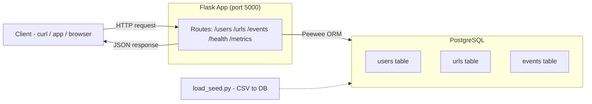

# Architecture

## Overview

The URL shortener is a pure backend REST API. No frontend. Clients interact directly with the Flask app via HTTP requests and receive JSON responses.

**Stack:** Flask · Peewee ORM · PostgreSQL · uv

## Diagram

## How it works

A client sends an HTTP request to the Flask app. Flask routes it to the correct handler, which queries PostgreSQL via the Peewee ORM and returns a JSON response. The database is pre-populated on setup using `load_seed.py` which loads `users.csv`, `urls.csv`, and `events.csv`.

## Components

| Component | Technology | Purpose |
|---|---|---|
| Web framework | Flask | Handles HTTP routing and responses |
| ORM | Peewee | Translates Python code to SQL queries |
| Database | PostgreSQL | Stores users, URLs, and events |
| Package manager | uv | Manages Python dependencies |
| Seed loader | load_seed.py | Populates DB from CSV files on setup |
